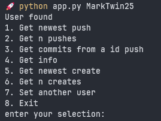

# GitHub User Activity

 A simple command line interface (CLI) that fetches the recent activity of a GitHub user and display it in the terminal.

## Install dependencies

```bash
pip install -r requirements.txt
```

## Usage

```bash
python app.py <username> 
```

if you are on windows you can use:

```bash
.\app <username>
```

## Example

Now, let's see how it works:




Let's try to get the newest push of the user:


This project is part of the Roadmap.sh project:

https://roadmap.sh/projects/github-user-activity